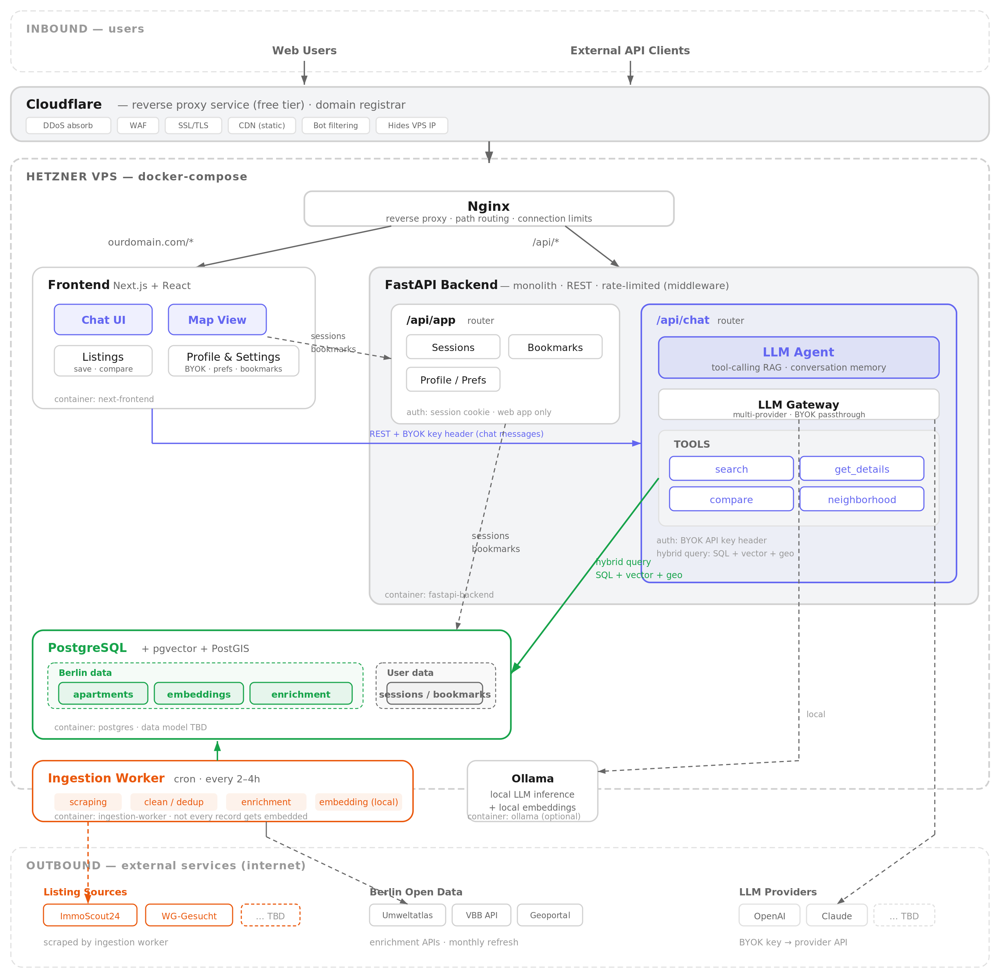

# flat-chat

Berlin Apartment AI Assistant — a chatbot to help Berliners find apartments quickly and make informed decisions through conversational search.

## Quick Start

```bash
cp .env.example .env    # then fill in ANTHROPIC_API_KEY, JINA_API_KEY
docker compose up --build
```

Open [http://localhost](http://localhost). First launch takes a couple of minutes (image builds).

Manual data ingestion (cron-triggered in prod):

```bash
docker compose --profile ingestion run --rm ingestion
```

## Architecture



Source: [`architecture.drawio`](architecture.drawio) — edit in draw.io Desktop or app.diagrams.net, then run `./render.sh` to regenerate the PNG.

## Project Structure

```
flat-chat/
├── docker-compose.yml          # Orchestrates all services
├── nginx/                      # Reverse proxy — only port 80 exposed to host (also serves /tiles/)
├── data/tiles/                 # Protomaps .pmtiles extract for MapLibre (bind-mounted into nginx)
├── services/
│   ├── frontend/               # React + Vite + CopilotKit + MapLibre — see services/frontend/src/
│   ├── backend/                # FastAPI + Pydantic AI agent (AG-UI streaming) — see services/backend/README.md
│   ├── ingestion/              # Cron-triggered data ingestion
│   └── postgres/               # Custom image: PostgreSQL + pgvector + PostGIS
└── agent-compound-docs/        # Architecture decisions, plans, design conversations
```

## Tech Stack

| Layer            | Technology                                                                                          |
|------------------|-----------------------------------------------------------------------------------------------------|
| Frontend         | React, Vite, TypeScript, Tailwind, **CopilotKit (AG-UI)**, **MapLibre GL JS v5** + `@vis.gl/react-maplibre` |
| Backend          | FastAPI, SQLAlchemy, **Pydantic AI with AG-UI Protocol adapter**                                    |
| LLM              | Pydantic AI agent → Anthropic-direct (native prompt caching)                                        |
| Embeddings       | Jina v3 (`retrieval.query` task LoRA)                                                               |
| Database         | PostgreSQL + pgvector (semantic search) + PostGIS (geo)                                             |
| Map tiles        | Self-hosted **Protomaps** `.pmtiles` (Berlin extract) — served by nginx at `/tiles/`                |
| Observability    | Phoenix (Arize) via OpenInference + OpenTelemetry — UI at `:6006`                                   |
| Infrastructure   | Docker, Docker Compose, Nginx                                                                       |

## Where to look next

- **[`CLAUDE.md`](CLAUDE.md)** — project-wide conventions, architecture notes, Pydantic AI patterns.
- **[`services/backend/README.md`](services/backend/README.md)** — backend dev workflow, API reference, config table.
- **[`agent-compound-docs/decisions/`](agent-compound-docs/decisions/)** — what we chose and why (agent framework, frontend stack, LLM tool result design, deployment, …).
- **[`agent-compound-docs/decisions/chat-runtime-and-streaming.md`](agent-compound-docs/decisions/chat-runtime-and-streaming.md)** — how the AG-UI streaming pipeline, session store, and SSE plumbing fit together end-to-end. Required reading before changing `chat/service.py`, `chat/sessions.py`, `chat/tools.py`, or the nginx `/api/agent` block.

## MVP Scope

- User describes apartment requirements to the chatbot.
- Iterative refinement through conversation.
- Results stream into a persistent map + apartment cards artifact alongside the chat (chat-host layout, desktop-only).
- Berlin only.
