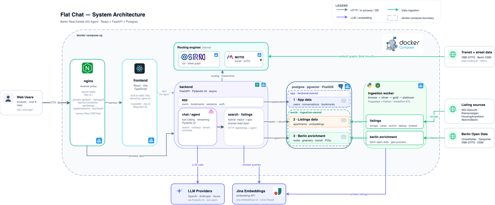

# flat-chat

Flat Chat — the Berlin Real Estate (AI) Agent. A chatbot to help Berliners find apartments quickly and make informed decisions through conversational search.

## Quick Start

```bash
cp .env.example .env    # then set one LLM provider key (OPENAI_API_KEY / ANTHROPIC_API_KEY / Azure quartet) + JINA_API_KEY
docker compose up --build
```

Open [http://localhost](http://localhost). First launch takes a couple of minutes (image builds).

Manual data ingestion (cron-triggered in prod):

```bash
docker compose --profile ingestion run --rm ingestion
```

## Deploying

Public exposure is via a **Cloudflare Tunnel** (outbound-only; free HTTPS, no
port-forwarding) and CD is a **self-hosted GitHub Actions runner** that runs
`scripts/deploy.sh` on a green `main`. Prod config lives in
`docker-compose.prod.yml`. Full setup (domain, tunnel token, runner) is in
[`agent-compound-docs/decisions/deployment-guide.md`](agent-compound-docs/decisions/deployment-guide.md).

## Architecture



Source: [`architecture.drawio`](architecture.drawio) — edit in draw.io Desktop or app.diagrams.net, then run `./scripts/render.sh` to regenerate the PNG.

## Project Structure

```
flat-chat/
├── docker-compose.yml          # Orchestrates all services
├── nginx/                      # Reverse proxy — only port 80 exposed to host (also serves /tiles/)
├── data/tiles/                 # Protomaps .pmtiles extract for MapLibre (bind-mounted into nginx)
├── services/
│   ├── frontend/               # React + Vite + CopilotKit + MapLibre — see services/frontend/src/
│   ├── backend/                # FastAPI + Pydantic AI agent (AG-UI streaming) — see services/backend/README.md
│   ├── ingestion/              # Cron-triggered ETL — medallion pipeline (iron→bronze→silver→gold→platinum) + geo-context
│   └── postgres/               # Custom image: PostgreSQL + pgvector + PostGIS
└── agent-compound-docs/        # Architecture decisions, plans, design conversations
```

## Tech Stack

| Layer            | Technology                                                                                          |
|------------------|-----------------------------------------------------------------------------------------------------|
| Frontend         | React, Vite, TypeScript, Tailwind, **CopilotKit (AG-UI)**, **MapLibre GL JS v5** + `@vis.gl/react-maplibre` |
| Backend          | FastAPI, SQLAlchemy, Alembic, **Pydantic AI with AG-UI Protocol adapter**                           |
| Auth             | **fastapi-users** (password login, Argon2 via `pwdlib`, JWT cookie)      |
| LLM              | Pydantic AI agent → OpenAI (preferred) · Anthropic-direct (native prompt caching) · Azure OpenAI (order: OpenAI > Anthropic > Azure) |
| Embeddings       | Jina v3 (`retrieval.query` task LoRA)                                                               |
| Database         | PostgreSQL + pgvector (semantic search) + PostGIS (geo)                                             |
| Map tiles        | Self-hosted **Protomaps** `.pmtiles` (Berlin extract) — served by nginx at `/tiles/`                |
| Observability    | Phoenix (Arize) via OpenInference + OpenTelemetry — UI at `:6006`                                   |
| Infrastructure   | Docker, Docker Compose, Nginx                                                                       |

## Data Pipeline

Listings flow through a medallion pipeline — **iron** (raw scraped cards) → **bronze** (raw scraped detail dumps) → **silver** (normalized `listings`) → **gold** (`listings_geo_context`, the per-listing geo enrichment the search service actually queries) → **platinum** (`listings_embeddings`, Jina vectors for semantic ranking). Node scrapers (puppeteer) write directly to iron and bronze; a Python transformer reads bronze and upserts silver, then chains gold + platinum. Geo-context (parks, schools, noise, transit, …) is a **separate** pipeline on its own cadence.

See **[services/ingestion/README.md](services/ingestion/README.md)** for commands, JSON replay, and cursor-resume semantics.

## Where to look next

- **[`CLAUDE.md`](CLAUDE.md)** — project-wide conventions, architecture notes, Pydantic AI patterns.
- **[`services/backend/README.md`](services/backend/README.md)** — backend dev workflow, API reference, config table.
- **[`agent-compound-docs/decisions/`](agent-compound-docs/decisions/)** — what we chose and why (agent framework, LLM tool result design, deployment, …).
- **[`agent-compound-docs/decisions/gdpr.md`](agent-compound-docs/decisions/gdpr.md)** — GDPR / personal-data handling (no poster PII stored; user data under contract necessity; EU-resident LLM). The user-facing privacy notice is served at `/privacy.html`.

## MVP Scope

- User describes apartment requirements to the chatbot.
- Iterative refinement through conversation.
- Results stream into a persistent map + apartment cards artifact alongside the chat (chat-host layout, desktop-only).
- Berlin only.
